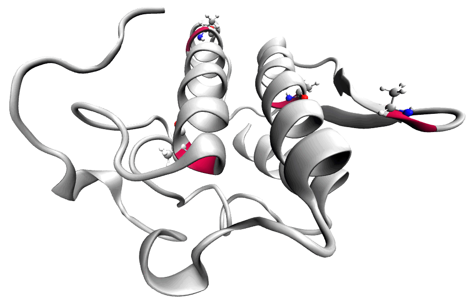
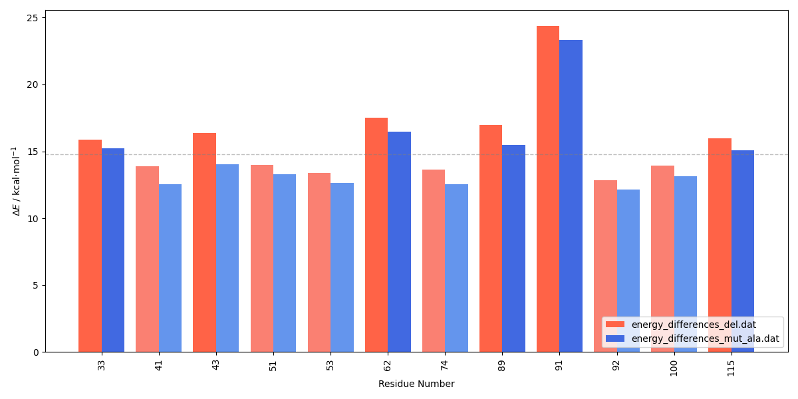

 

<h2>
 <b>Multipoint Mutagenesis</b> 
 </h2>

<b>This protocol is designed to evaluate activation energies of multipoint mutant variants. The mutated residues are submitted to molecular dynamics and geometry optimization to produce a more natural conformation while keeping the rest of the system fixed. </b>

<b>The protocol requires the following inputs:</b>
 
● File listing the mutations in the variants
 
● Topology file in *prmtop format
 
● Reactant and transition state structures in *pdb format
 
● LEaP and CP2K input templates
 
● Selection of the QM region
 
● File listing cpptraj selections of atoms to keep free during GEO_OPT and MD
 
 
<b>Additionally, the following software packages are needed:</b>
 
● CP2K
 
● PyMOL
 
● VMD
 
● CPPTRAJ (from AmberTools)
 
● LEaP (from AmberTools)
 
● ParmED (from AmberTools)

---

 
<h2> 
 <b>I - Input Preparation </b> 
</h2>

 

A selection in the format presented in qm_selection.dat is required to adequately build the QM system (the atom numbers will change upon residue deletion, resid's remain the same). The preparation of the selection is explained in the I - Input Preparation section of the <a href="https://arvpinto.github.io/enzyme_mutagenesis_cp2k/residue_deletion.html" target="_blank">residue deletion protocol</a>.

 

The <a href="https://arvpinto.github.io/enzyme_mutagenesis_cp2k/mutagenesis_multi/mp_mut_qmmm_cp2k.sh" target="_blank">mp_mut_qmmm_cp2k.sh</a> script has the following usage:

<pre style="color: white; background-color: black;">
./mp_mut_qmmm_cp2k.sh &lt;mutant_list&gt; &lt;topology&gt; &lt;reactant_structure&gt; &lt;ts_structure&gt; &lt;selection&gt; &lt;leap_template&gt; &lt;cp2k_template&gt; &lt;qm_selection&gt; &lt;selection_free&gt;
    
user@machine:~$ ./mp_mut_qmmm_cp2k.sh mut_list.dat hpla2_ee.prmtop R.pdb TS.pdb :1-124 leap_template.in cp2k_template.inp qm_selection.dat selection_free.dat
</pre>

It prepares a directory for each mutant variant in the list where the input files for CP2K will be output. A given mutant variant can be specified as &lt;name&gt; &lt;number&gt;&lt;residue&gt; in the file mutant variant list (e.g. MUT_001 41LYS 53ASP 74GLU 92ASP). Note: when mutating a CYX residue in a disulfide bridge, the other CYX is converted to CYS. The <selection> argument defines the residue range of the enzyme (its parameters are updated, while the rest of the system remains unchanged). The LEaP input should be consistent with the original parameterization. The cp2k_template.inp file is used to produce molecular dynamics, geometry optimization and single-point point energy input files. The &lt;selection_free&gt; argument requires a file containing cpptraj selections for each mutant variant, specifying the atoms that remain unfrozen (e.g. MUT_001 (:41,53,74,92&!@N,H,CA,HA,C,O)&lt;:3).

 
    

To generate the structures and topology of the mutated enzyme, the <a href="https://arvpinto.github.io/enzyme_mutagenesis_cp2k/mutagenesis_multi/mp_mutation.sh" target="_blank">mp_mutation.sh</a> script is called by the mut_scan_qmmm_cp2k.sh script and has the following syntax:

<pre style="color: white; background-color: black;">
user@machine:~$ ./mp_mutation.sh &lt;mut_name&gt; &lt;residue_list&gt; &lt;topology&gt; &lt;reactant_structure&gt; &lt;ts_structure&gt; &lt;selection&gt; &lt;leap_template&gt;
</pre>

 

Since mutating residues changes the atom numbering, the QM/MM settings must be updated for each mutation. The <a href="https://arvpinto.github.io/enzyme_mutagenesis_cp2k/mutagenesis_multi/mut_qm_sel.sh" target="_blank">mut_qm_sel.sh</a> script checks how the mutated residues should be included in the QM layer and modifies the qm_selection.dat file accordingly. It has the following usage:

<pre style="color: white; background-color: black;">
user@machine:~$ ./mut_qm_sel.sh &lt;number&gt; &lt;residue&gt; &lt;topology&gt; &lt;qm_selection&gt;
</pre>

 
    

<a href="https://arvpinto.github.io/enzyme_mutagenesis_cp2k/mutagenesis_scan/vmd_forceeval.tcl" target="_blank">vmd_forceeval.tcl</a> script is called within the latter to produce a file with the configuration of the QM layer, defined by the selection in the qm_selection.dat file.

 

The calculations can then be run using a for loop:
<pre style="color: white; background-color: black;">
user@machine:~$ for i in MUT_*; do cd "$i" ; cp2k.popt -i opt_res_R.inp -o opt_res_R.out ; cp2k.popt -i scan_res_R.inp -o scan_res_R.out ; cp2k.popt -i opt_res_TS.inp -o opt_res_TS.out ; cp2k.popt -i scan_res_TS.inp -o scan_res_TS.out ; cd .. ; done
</pre>

 

    

 

<h2> 
 <b>II - Output Processing</b> 
</h2>

 

After running the optimization and single-point calculations, the following command allows us to extract the absolute energies and calculate the R->TS energy barrier for each residue mutation:

<pre style="color: white; background-color: black;">
user@machine:~$ paste <(for i in MUT_*; do echo "$i" | sed 's/MUT_//g'; done) <(for i in MUT_*; do echo $(grep "Total FORCE" "$i"/scan_res_TS.out | tail -n -1) ; done | awk '{print $9}') <(for i in ALA_*; do echo $(grep "Total FORCE" "$i"/scan_res_R.out | tail -n -1) ; done | awk '{print $9}') | awk '{print $1,($2-$3)*627.509}' | sort -n -k1,1 > energy_differences_mut.dat
</pre>

 

The energy barriers can be compared to the ones calculated with the <a href="https://arvpinto.github.io/enzyme_mutagenesis_cp2k/residue_deletion.html" target="_blank">residue deletion protocol</a> using the <a href="https://arvpinto.github.io/enzyme_mutagenesis_cp2k/mutagenesis_scan/E_diff_comparison_bar_plot.py" target="_blank">E_diff_comparison_bar_plot.py</a> script:

<pre style="color: white; background-color: black;">
user@machine:~$ python E_diff_comparison_bar_plot.py energy_differences_del.dat energy_differences_mut.dat
</pre>

 

    

 

 The calculated energy barriers upon deletion can be compared with the original energy barrier (14.8 kcal⋅mol-1) to see if the residues are stabilizing or destabilizing to the transition state of the reaction step. Here, we can see that the deletion of most residues is unfavorable (this is expected for a small protein in a system with a considerable amount of charged molecules), however, the deletion of residue 92 decreases the energy barrier. 

 

 The script plots the calculated energy barriers against d1-d2, where d1 is the distance between the center of geometry of the deleted residue and the midpoint between the atoms that represent the direction of the positive charge, and d2 is the distance between the center of geometry of the deleted residue and the midpoint between the atoms that represent the direction of the negative charge. Suppose the used conformation is considerably stable and the charge separation reaction is simple. In that case, this approach can accurately capture and quantify the electrostatic contribution of residues to the transition state. Usually, negatively charged residues close to the positive moiety stabilize the transition state, while positively charged residues are destabilizing (and vice-versa relative to the negatively charged moiety). Note that the electric field induced by enzymes can be quite complex and the latter assumption might not always be true. For example, if a positively charged residue is close to the positive charge, but stabilizing the negative charges of two chemical groups nearby, the repulsion that arises from the lack of neutralizing positive charge may increase the energy barrier instead. In any case, when discussing this type of result, the environment of the specific residues should be taken into account. 

 
