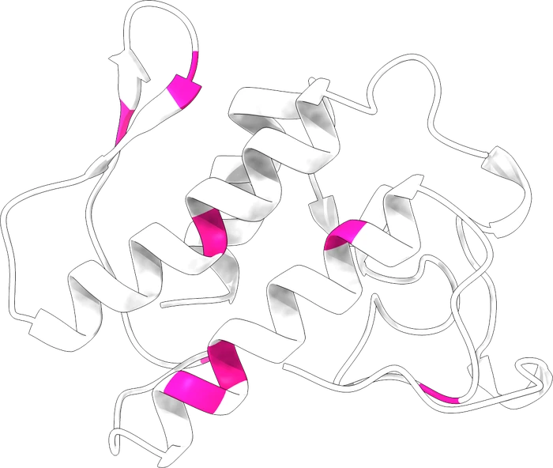
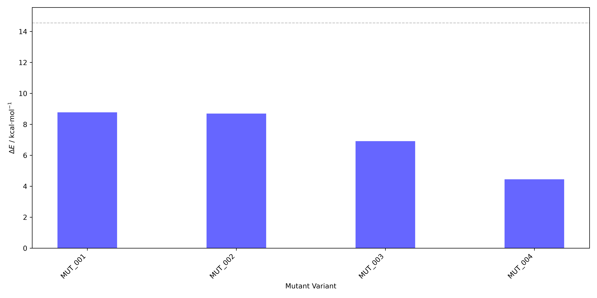

 

<h2> 
 <b>III - Multipoint mutagenesis</b> 
</h2>

    

 

<b>This protocol is designed to evaluate activation energies of multipoint mutant variants. The mutated residues are submitted to molecular dynamics and geometry optimization to produce a more natural conformation while keeping the rest of the system fixed. </b>

The protocol requires the following inputs:

<ul>
<li>
file listing the mutations in the variants;
</li>
<li>
topology file in *prmtop format;
</li>
<li>
reactant and transition state structures in *pdb format;
</li>
<li>
LEaP and CP2K input templates;
</li>
<li>
selection of the QM region;
</li>
<li>
file listing cpptraj selections of atoms to keep free during GEO_OPT and MD.
</li>
</ul>

Additionally, the following software packages are needed:

<ul>
<li>
CP2K;
</li>
<li>
CPPTRAJ (from AmberTools);
</li>
<li>
LEaP (from AmberTools);
</li>
<li>
ParmEd (from AmberTools);
</li>
<li>
Python 3 with NumPy and Matplotlib.
</li>
</ul>

---

 
<h3>
 <b> Input preparation </b>
</h3>

 

A selection in the format presented in qm_selection.dat is required to adequately build the QM system (the atom numbers will change upon mutation, resid's remain the same). The preparation of the selection is explained in the I - Input Preparation section of the <a href="https://arvpinto.github.io/enzyme_mutagenesis_cp2k/residue_deletion.html" target="_blank">residue deletion protocol</a>.

 

The <a href="https://arvpinto.github.io/enzyme_mutagenesis_cp2k/scripts/mut_mp_qmmm_cp2k.sh" target="_blank">mut_mp_qmmm_cp2k.sh</a> script has the following usage:

<pre style="color: white; background-color: black;">
mut_mp_qmmm_cp2k.sh [options] &lt;mutant_list&gt; &lt;topology&gt; &lt;reactant_structure&gt; &lt;ts_structure&gt; &lt;selection&gt; &lt;leap_template&gt; &lt;cp2k_template&gt; &lt;qm_selection&gt; &lt;selection_free&gt;
    
user@machine:~$ mut_mp_qmmm_cp2k.sh --qmmm-reference forceeval_qmmm.inc variant_list.dat hpla2_ee.prmtop R.pdb TS.pdb :1-124 leap_template.in cp2k_template.inp qm_selection.dat free_selection.dat
</pre>

It prepares a directory for each mutant variant in the list where the input files for CP2K will be output, and a WT directory with the single-points of the unmodified system. A given mutant variant can be specified as &lt;name&gt; &lt;number&gt;&lt;residue&gt; in the file mutant variant list (e.g. MUT_001 41LYS 53ASP 74GLU 92ASP). Note: when mutating a CYX residue in a disulfide bridge, the other CYX is converted to CYS. The &lt;selection&gt; argument defines the residue range of the enzyme, which has to be the first block of atoms of the topology (its parameters are updated, while the rest of the system remains unchanged). The LEaP input has to load the same force field that was used for the original topology, as explained in the <a href="https://arvpinto.github.io/enzyme_mutagenesis_cp2k/mutagenesis_scan.html" target="_blank">mutagenesis scan protocol</a>. The cp2k_template.inp file is used to produce molecular dynamics, geometry optimization and single-point energy input files. The &lt;selection_free&gt; argument requires a file containing cpptraj selections for each mutant variant, specifying the atoms that remain unfrozen (e.g. MUT_001 :41,53,74,92|((((:41,53,74,92)&amp;!@N,H,CA,HA,C,O)&lt;:2.5)&amp;!(:1-124&amp;@N,H,CA,HA,C,O)), i.e. the mutated residues and every residue within 2.5 Å of their sidechains, without the protein backbone). Backbone atom names should only be excluded within the protein residue range, since water oxygens are also named O; the script reports solvent molecules that end up only partly free. The selection is evaluated on the transition state structure and the same atoms are free in both states. The mp_summary.dat file reports what was done to each variant.

The first optimization and the molecular dynamics are classical, and the force field cannot describe the bonds that are being formed and broken in the transition state. For this reason, the atoms of the QM layer that are selected by &lt;selection_free&gt; and do not belong to a mutated residue are kept fixed (they are listed in mp_summary.dat). The <code>--allow-free-qm</code> option turns this off, and should only be used if none of those atoms takes part in the reaction. The length, time step and temperature of the molecular dynamics can be changed with the <code>--md-steps</code>, <code>--timestep</code> and <code>--temperature</code> options.

 
    

To generate the structures and topology of the mutated enzyme, the <a href="https://arvpinto.github.io/enzyme_mutagenesis_cp2k/scripts/build_mutant.sh" target="_blank">build_mutant.sh</a> script is called by the mut_mp_qmmm_cp2k.sh script and has the following syntax:

<pre style="color: white; background-color: black;">
build_mutant.sh [options] &lt;mut_name&gt; &lt;topology&gt; &lt;reactant_structure&gt; &lt;ts_structure&gt; &lt;selection&gt; &lt;leap_template&gt; &lt;mutation&gt; [&lt;mutation&gt; ...]
</pre>

The mutated residues keep their backbone atoms (and CB, unless GLY is involved), and LEaP rebuilds the rest of each residue from its template. The <code>place-sidechains</code> subcommand of <a href="https://arvpinto.github.io/enzyme_mutagenesis_cp2k/scripts/qmmm_mut_tools.py" target="_blank">qmmm_mut_tools.py</a> then samples the sidechain torsions of the new residues (staggered values for sp3 torsions, 30° steps for planar groups, followed by a local refinement) and keeps the conformation with the fewest steric overlaps with the rest of the system, including the solvent and the substrate. This is done separately for the reactant and the transition state, and the result of each residue is written to placement.log in the mutant directory. The <code>--no-placement</code> option keeps the geometry built by LEaP.

 

Since mutating residues changes the atom numbering, the QM/MM settings must be updated for each mutation. The <a href="https://arvpinto.github.io/enzyme_mutagenesis_cp2k/scripts/qmmm_mut_tools.py" target="_blank">qmmm_mut_tools.py</a> script checks how the mutated residues should be included in the QM layer and modifies the qm_selection.dat file accordingly. It has the following usage:

<pre style="color: white; background-color: black;">
qmmm_mut_tools.py mutate-selection -w &lt;topology&gt; -m &lt;mutant_topology&gt; -q &lt;qm_selection&gt; -o &lt;new_qm_selection&gt; &lt;mutation&gt; [&lt;mutation&gt; ...]
</pre>

The <code>qmmm-section</code> subcommand of <a href="https://arvpinto.github.io/enzyme_mutagenesis_cp2k/scripts/qmmm_mut_tools.py" target="_blank">qmmm_mut_tools.py</a> then writes a file with the configuration of the QM layer (QM cell, QM atoms and link atoms), defined by the selection in the qm_selection.dat file. The resulting QM layer is then checked against the topology (link atoms, charge, number of electrons), and no inputs are written for a variant that fails these checks.

By default, the QM cell is built around the QM atoms of each system (5 Å on each side) and the link atom parameters (<code>ALPHA_IMOMM</code> and <code>QMMM_SCALE_FACTOR</code>) are estimated from the charges of the MM atoms. If the QM/MM section used to obtain the original reaction path is available, it should be given with <code>--qmmm-reference forceeval_qmmm.inc</code> (the file used for this example is in the hpla2_example folder). The QM cell is then copied from that file, and every link atom that also exists in the original system keeps its original parameters, so that the WT single points reproduce the original setup and all variants share the same QM cell. Only links that did not exist before (for instance, around a mutated residue of the QM layer) get estimated parameters, and they are listed in the qmmm_section.log file. A system whose QM atoms do not fit in the reference cell (less than 2 Å from its edges, see <code>--min-margin</code>) is skipped.

 

The calculations can then be run using a for loop:
<pre style="color: white; background-color: black;">
user@machine:~$ cd WT ; cp2k.popt -i sp_res_R.inp -o sp_res_R.out ; cp2k.popt -i sp_res_TS.inp -o sp_res_TS.out ; cd ..
user@machine:~$ for i in MUT_*; do cd "$i" ; cp2k.popt -i opt_md_res_R.inp -o opt_md_res_R.out ; cp2k.popt -i md_res_R.inp -o md_res_R.out ; cp2k.popt -i opt_res_R.inp -o opt_res_R.out ; cp2k.popt -i sp_res_R.inp -o sp_res_R.out ; cp2k.popt -i opt_md_res_TS.inp -o opt_md_res_TS.out ; cp2k.popt -i md_res_TS.inp -o md_res_TS.out ; cp2k.popt -i opt_res_TS.inp -o opt_res_TS.out ; cp2k.popt -i sp_res_TS.inp -o sp_res_TS.out ; cd .. ; done
</pre>

 

<figure class="fig">
    <video class="theme-dark-only" src="assets/media/multi_md_dark.mp4" poster="assets/media/multi_md_dark.jpg" autoplay loop muted playsinline preload="metadata" aria-label="Classical MD of the reactant of the MUT_004 variant"></video>
    <video class="theme-light-only" src="assets/media/multi_md_light.mp4" poster="assets/media/multi_md_light.jpg" autoplay loop muted playsinline preload="metadata" aria-label="Classical MD of the reactant of the MUT_004 variant"></video>
    <figcaption><b>Classical MD of the reactant of MUT_004</b> (D41K, Y51F, R53D, R74E, K92D and R100E): first 1.5 ps of the MD of md_res_R.inp at 303 K, after the classical optimization, with a frame every 25 fs. The mutated residues are in magenta, the QM region in ball-and-stick, and the other atoms that are free during the MD (side chains and water molecules around the mutations) in thin sticks; the rest of the system stays fixed.</figcaption>
</figure>

 

<h3>
 <b> Output processing </b>
</h3>

 

After running the optimization and single-point calculations, the <a href="https://arvpinto.github.io/enzyme_mutagenesis_cp2k/scripts/extract_barriers.py" target="_blank">extract_barriers.py</a> script extracts the absolute energies and calculates the R->TS energy barrier for each mutant variant and for the unmodified system:

<pre style="color: white; background-color: black;">
user@machine:~$ extract_barriers.py --wt-dir WT -o energy_differences_multi.dat MUT_*
</pre>

Entries whose optimization stopped at the maximum number of steps without converging are reported by the script, and left out with the <code>--strict-opt</code> option.

 

The energy barriers can be plotted with the <a href="https://arvpinto.github.io/enzyme_mutagenesis_cp2k/scripts/E_diff_multi_bar_plot.py" target="_blank">E_diff_multi_bar_plot.py</a> script:

<pre style="color: white; background-color: black;">
user@machine:~$ E_diff_multi_bar_plot.py energy_differences_multi.dat
</pre>

    

 

 The calculated energy barriers of the mutant variants can be compared with the original energy barrier to see if the introduced mutations stabilize or destabilize the transition state of the reaction step. Since the reactant and the transition state of each variant are relaxed independently, the mutated residues and their surroundings may end up in different conformations in the two states, which adds a contribution to the energy barrier that is not related to the reaction. In this example the effects are close to additive: MUT_001 lowers the barrier by 5.8 kcal⋅mol-1, and the GLY scan values of the same four residues add up to 6.0 kcal⋅mol-1; for MUT_003 the two values are 7.6 and 7.7 kcal⋅mol-1. It is advisable to compare the optimized reactant and transition state structures of each variant, and to repeat the procedure from different molecular dynamics lengths or velocities before drawing conclusions from small differences. 

 
