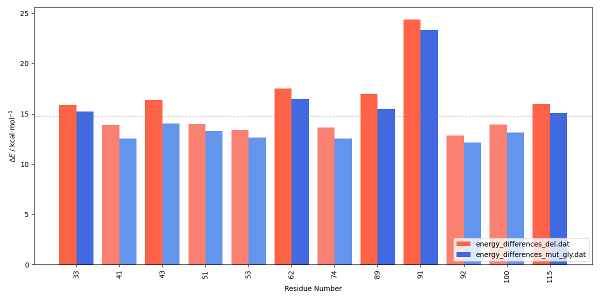

 

<h2>
 <b>Mutagenesis Scan</b> 
 </h2>

<b>This protocol is designed to perform a mutagenesis scan with residues such as ALA or GLY (other residues are also allowed). The mutated residues are optimized while keeping the rest of the system fixed, and then single-point calculations are performed on the provided reactant and transition state structures. </b>

<b>The protocol requires the following inputs:</b>
 
● File listing the residues to be mutated
 
● Topology file in *prmtop format
 
● Reactant and transition state structures in *pdb format
 
● LEaP and CP2K input templates
 
● Selection of the QM region
 
 
<b>Additionally, the following software packages are needed:</b>
 
● CP2K
 
● PyMOL
 
● VMD
 
● CPPTRAJ (from AmberTools)
 
● LEaP (from AmberTools)
 
● ParmED (from AmberTools)

---

 
<h2> 
 <b>I - Input Preparation </b> 
</h2>

 

To properly construct the QM system, a selection in the format of qm_selection.dat is required. Note that atom numbers will change upon residue deletion, while residue IDs (resid's) will remain the same in the PDB files. The preparation of the selection is explained in the I - Input Preparation section of the <a href="https://arvpinto.github.io/enzyme_mutagenesis_cp2k/residue_deletion.html" target="_blank">residue deletion protocol</a>.

 

The <a href="https://arvpinto.github.io/enzyme_mutagenesis_cp2k/mutagenesis_scan/mut_scan_qmmm_cp2k.sh" target="_blank">mut_scan_qmmm_cp2k.sh</a> script has the following usage:

<pre style="color: white; background-color: black;">
./mut_scan_qmmm_cp2k.sh &lt;residue_list&gt; &lt;scan_type&gt; &lt;topology&gt; &lt;reactant_structure&gt; &lt;ts_structure&gt; &lt;selection&gt; &lt;leap_template&gt; &lt;cp2k_template&gt; &lt;qm_selection&gt;

user@machine:~$ ./mut_scan_qmmm_cp2k.sh residue_list.dat GLY hpla2_ee.prmtop R.pdb TS.pdb :1-124 leap_template.in cp2k_template.inp qm_selection.dat
</pre>

It prepares a directory for each residue in the list where the input files for CP2K will be output. The &lt;scan_type&gt; argument represents the three-letter code of the residue used in the scan. ALA and GLY are suitable for assessing sidechain contributions, whereas residues with greater volume and more degrees of freedom may complicate the analysis. Note: when mutating a CYX residue in a disulfide bridge, the other CYX is converted to CYS. The &lt;selection&gt; argument defines the residue range of the enzyme (its parameters are updated, while the rest of the system remains unchanged). The LEaP input should be consistent with the original parameterization. The cp2k_template.inp file is used to produce geometry optimization and single-point point energy input files.

 

To generate the structures and topology of the mutated enzyme, the <a href="https://arvpinto.github.io/enzyme_mutagenesis_cp2k/mutagenesis_scan/sp_mutation.sh" target="_blank">sp_mutation.sh</a> script is called by the mut_scan_qmmm_cp2k.sh script and has the following syntax:

<pre style="color: white; background-color: black;">
./sp_mutation.sh &lt;number&gt; &lt;residue&gt; &lt;topology&gt; &lt;reactant_structure&gt; &lt;ts_structure&gt; &lt;selection&gt; &lt;leap_template&gt;
</pre>

 

Since mutating residues changes the atom numbering, the QM/MM settings must be updated for each mutation. The <a href="https://arvpinto.github.io/enzyme_mutagenesis_cp2k/mutagenesis_scan/mut_qm_sel.sh" target="_blank">mut_qm_sel.sh</a> script is called by the mut_scan_qmmm_cp2k.sh script to check how the mutated residue should be included in the QM layer and modify the qm_selection.dat file accordingly. It has the following usage:

<pre style="color: white; background-color: black;">
./mut_qm_sel.sh &lt;number&gt; &lt;residue&gt; &lt;topology&gt; &lt;qm_selection&gt;
</pre>

 
    

The <a href="https://arvpinto.github.io/enzyme_mutagenesis_cp2k/mutagenesis_scan/vmd_forceeval.tcl" target="_blank">vmd_forceeval.tcl</a> script is called within the mut_scan_qmmm_cp2k.sh to produce a file with the configuration of the QM layer, defined by the selection in the qm_selection.dat file.

 

The calculations can then be run using a for loop:
<pre style="color: white; background-color: black;">
user@machine:~$ for i in GLY_*; do cd "$i" ; cp2k.popt -i opt_res_R.inp -o opt_res_R.out ; cp2k.popt -i scan_res_R.inp -o scan_res_R.out ; cp2k.popt -i opt_res_TS.inp -o opt_res_TS.out ; cp2k.popt -i scan_res_TS.inp -o scan_res_TS.out ; cd .. ; done
</pre>

 

<h2> 
 <b>II - Output Processing</b> 
</h2>

 

After running the optimization and single-point calculations, the following command allows us to extract the absolute energies and calculate the R->TS energy barrier for each residue mutation:

<pre style="color: white; background-color: black;">
user@machine:~$ paste <(for i in GLY_*; do echo "$i" | sed 's/GLY_//g'; done) <(for i in GLY_*; do echo $(grep "Total FORCE" "$i"/scan_res_TS.out | tail -n -1) ; done | awk '{print $9}') <(for i in GLY_*; do echo $(grep "Total FORCE" "$i"/scan_res_R.out | tail -n -1) ; done | awk '{print $9}') | awk '{print $1,($2-$3)*627.509}' | sort -n -k1,1 > energy_differences_mut.dat
</pre>

 

The energy barriers can be compared to the ones calculated with the <a href="https://arvpinto.github.io/enzyme_mutagenesis_cp2k/residue_deletion.html" target="_blank">residue deletion protocol</a> using the <a href="https://arvpinto.github.io/enzyme_mutagenesis_cp2k/mutagenesis_scan/E_diff_comparison_bar_plot.py" target="_blank">E_diff_comparison_bar_plot.py</a> script:

<pre style="color: white; background-color: black;">
user@machine:~$ python E_diff_comparison_bar_plot.py energy_differences_del.dat energy_differences_mut_gly.dat
</pre>

    

 The energy barriers exhibit a similar trend in both cases, however, backbone deletion results in higher barriers compared to mutation by GLY. The difference is more pronounced with CYX43, as deletion results in a deprotonated cysteine residue, whereas the mutation yields a protonated cysteine. As expected, either deletion or mutation of the catalytic ASP91 results in a significantly higher energy barrier. Residues that significantly lower the energy barrier become key hotspots for targeted mutagenesis studies. It is important to note that different conformations in the R and TS states might break the adiabatic connection and lead to jumps in the PES.

 
