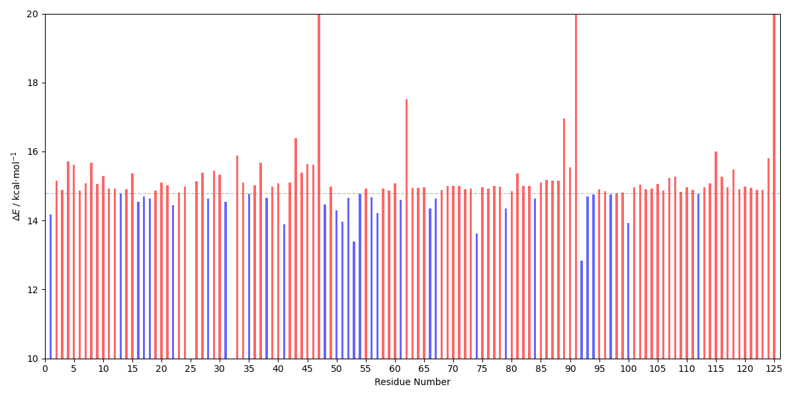
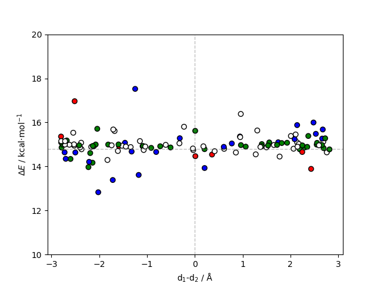

 

<h2>
 <b>Residue Deletion</b> 
 </h2>

<b>This protocol aims to assess the energy contribution of individual amino acid residues to the energy barrier of a specified reaction. This is accomplished by performing single-point calculations on both the reactant and transition state structures, each with a specific residue omitted.</b>

<b>The protocol requires the following inputs:</b>
 
● File listing the residues to be deleted
 
● Topology file in *prmtop format
 
● Reactant and transition state structures in *pdb format
 
● CP2K input template
 
● Selection of the QM region
 
 
<b>Additionally, the following software packages are needed:</b>
 
● CP2K
 
● VMD
 
● CPPTRAJ (from AmberTools)

---

 
<h2> 
 <b>I - Input Preparation </b> 
</h2>

 

To properly construct the QM system, a selection in the format of qm_selection.dat is required. Note that atom numbers will change upon residue deletion, while residue IDs (resid's) will remain the same in the PDB files. Follow these steps to achieve the required selection:

 
Open the system in VMD, save a *.gro file and a serial_numbers.dat file with the serial numbers of a selection:
<pre style="color: white; background-color: black;">
user@machine:~$ vmd hpla2.prmtop R.pdb
# save a *.gro file of the system
animate write gro system.gro 
# make a VMD selection
set sel [atomselect 0 "index 426 430 436 440 443 447 459 463 466 470 673 677 679 682 684 688 690 694 696 699 702 706 728 731 732 734 736 739 741 985 988 989 991 993 996 998 1357 1360 1939 1942 1945 1948 1951 1953 1959 1962 1966 1970 1974 1981 1983 1986 1989 1992 1897 429 431 439 441 442 446 448 462 464 465 469 471 472 676 678 680 681 685 687 689 693 695 697 698 705 707 729 730 733 735 738 740 742 986 987 990 992 995 997 999 1358 1359 1940 1941 1943 1944 1949 1950 1952 1954 1955 1960 1961 1963 1964 1967 1968 1969 1971 1972 1973 1975 1976 1977 1984 1985 1987 1988 1990 1991 1993 1994 34854 34855 428 438 445 461 468 675 683 686 692 704 1965 427 437 444 460 467 674 691 700 701 703 737 994 1361 1362 1946 1947 1956 1958 1978 1979 1980 1982 34853 1957"] 
# get the serial numbers
set serial_numbers [$sel get serial] 
# save the serial numbers to a serial_numbers.dat file
set output [open "serial_numbers.dat" "w"] 
puts $output $serial_numbers
close $output
quit
# replace spaces by + for a PYMOL compatible selection
user@machine:~$ sed -i 's/ /+/g' serial_numbers.dat 
</pre>

The *.gro file can then be opened in PYMOL, the selection introduced and a HL.mol2 file exported:
<pre style="color: white; background-color: black;">
user@machine:~$ pymol -cq system.gro -d "select my_selection, index $(paste -sd+ serial_numbers.dat); save HL.mol2, my_selection"
</pre>

Then the <a href="https://arvpinto.github.io/enzyme_mutagenesis_cp2k/scripts/mol2_vmd-qmsel.sh" target="_blank">mol2_vmd-qmsel.sh</a> script can be used to extract the selection in the required format:
<pre style="color: white; background-color: black;">
user@machine:~$ mol2_vmd-qmsel.sh HL.mol2 > qm_selection.dat
</pre>

 

The <a href="https://arvpinto.github.io/enzyme_mutagenesis_cp2k/scripts/del_res_qmmm_cp2k.sh" target="_blank">del_res_qmmm_cp2k.sh</a> script has the following usage:

<pre style="color: white; background-color: black;">
del_res_qmmm_cp2k.sh &lt;residue_list&gt; &lt;topology&gt; &lt;reactant_structure&gt; &lt;ts_structure&gt; &lt;cp2k_template&gt; &lt;qm_selection&gt;
    
user@machine:~$ del_res_qmmm_cp2k.sh residue_list.dat hpla2_ee.prmtop R.pdb TS.pdb cp2k_template.inp qm_selection.dat
</pre>

 The script creates a directory for each residue in the list, where the CP2K input files will be generated. It processes the provided topology and structures using CPPTRAJ to remove the specified residues. To maintain the QM/MM configuration, the backbone of boundary residues is preserved while only their sidechains are deleted (GLY and PRO residues at the QM/MM boundary are not deleted). Since residue deletion alters atom numbering, the QM/MM settings must be updated accordingly after each deletion. The <a href="https://arvpinto.github.io/enzyme_mutagenesis_cp2k/scripts/vmd_forceeval.tcl" target="_blank">vmd_forceeval.tcl</a> script is called within the latter to produce a file with the configuration of the QM layer, defined by the selection in the qm_selection.dat file. 

 

The calculations can then be run using a for loop:
<pre style="color: white; background-color: black;">
user@machine:~$ for i in RES_*; do cd "$i" ; cp2k.popt -i sp_res_R.inp -o sp_res_R.out ; cp2k.popt -i sp_res_TS.inp -o sp_res_TS.out ; cd .. ; done
</pre>

 

<h2> 
 <b>II - Output Processing</b> 
</h2>

 

After running the single-point calculations, the following command allows us to extract the absolute energies and calculate the R->TS energy barrier for each residue deletion:

<pre style="color: white; background-color: black;">
user@machine:~$ paste <(for i in RES_*; do echo "$i" | sed 's/RES_//g'; done) <(for i in RES_*; do echo $(grep "Total FORCE" "$i"/sp_res_TS.out | tail -n -1) ; done | awk '{print $9}') <(for i in RES_*; do echo $(grep "Total FORCE" "$i"/sp_res_R.out | tail -n -1) ; done | awk '{print $9}') | awk '{print $1,($2-$3)*627.509}' | sort -n -k1,1 > energy_differences_del.dat
</pre>

 

The energy barriers can be plotted with the <a href="https://arvpinto.github.io/enzyme_mutagenesis_cp2k/hpla2_example/E_diff_bar_plot.py" target="_blank">E_diff_bar_plot.py</a> script:

<pre style="color: white; background-color: black;">
user@machine:~$ python E_diff_bar_plot.py energy_differences_del.dat
</pre>

    

 The calculated energy barriers upon deletion can be compared with the original energy barrier (14.8 kcal⋅mol-1) to see if the residues are stabilizing or destabilizing to the transition state of the reaction step. Here, we can see that the deletion of most residues is unfavorable, however, there are many residues whose deletion decreases the energy barrier associated with the TS. 

 

For reactions involving charge separation, it might be useful to represent the residues relative to the separation plane that characterizes the macrodipole induced by the enzyme. This can be done with the <a href="https://arvpinto.github.io/enzyme_mutagenesis_cp2k/hpla2_example/E_diff_dist_plot.py" target="_blank">E_diff_dist_plot.py</a> script:

<pre style="color: white; background-color: black;">
user@machine:~$ python E_diff_dist_plot.py TS.pdb energy_differences_del.dat 684 34856 1982 34854
</pre>

    

 The script plots the calculated energy barriers against d1-d2, where d1 is the distance between the center of geometry of the deleted residue and the midpoint between the atoms that represent the direction of the positive charge, and d2 is the distance between the center of geometry of the deleted residue and the midpoint between the atoms that represent the direction of the negative charge. In principle, this approach can accurately capture and quantify the electrostatic contribution of residues to the transition state. Usually, negatively charged residues close to the positive moiety stabilize the transition state, while positively charged residues are destabilizing (and vice-versa relative to the negatively charged moiety). Note that the electric field induced by enzymes can be quite complex and these assumptions might not always hold. Suppose that a positively charged residue is close to the positive charge, but stabilizing the negative charges of two chemical groups nearby, the repulsion that arises from the lack of neutralizing positive charge may increase the energy barrier instead. In any case, when discussing this type of result, the environment of the specific residues should be taken into account. 

 
